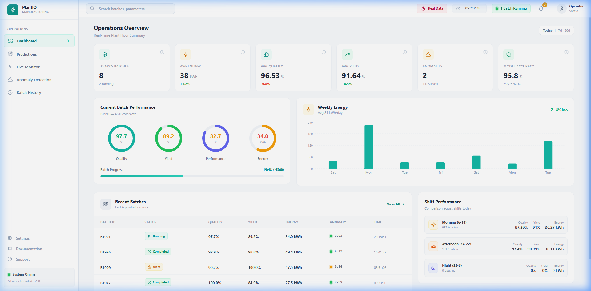

<div align="center">

# 🚀 VibeCon Hackathon — Portfolio

### *Built Different. Built Fast. Built to Last.*

---

[]()
[]()
[]()

</div>

---

## 🧠 About Me

> *"Curiosity killed the cat..."*

Hey — I'm **Hari Reddy**, a student at the **Army Institute of Technology**, and someone who simply **cannot stop experimenting about new things**.
I don't just learn tech — I **tear it apart**, rebuild it, break it again, and then ship it.
Every project in this repo started from a **"what if?"** moment at 2 AM and turned into a full-fledged system by morning.
I jump between **cybersecurity**, **AI agents**, **manufacturing intelligence**, **fintech**, and **geopolitical knowledge graphs** — not because I can't pick a lane, but because **every lane is interesting**.
If there's a new tool, a new framework, a new paradigm — I've already tried it, broken it, and probably built something weird with it.
I believe the best way to learn anything is to **build something real** with it, ship it, and then figure out what to build next.

> *"...but satisfaction brought it back."*

---

## 🔥 Why Me?

- I am **deeply passionate** about building things — not toy demos, but **systems that actually work end-to-end**
- I **experiment relentlessly** with every tool I can get my hands on — from **local LLMs** to **graph databases** to **self-evolving AI agents**
- I am currently building **[systflow.dev](https://systflow.dev)** — an **AI autonomous company** that works for you, handles operations, and scales without human bottlenecks
- I am also building a **startup** that lets you bring your **wildest dreams to life** — think of it as a **startup builder for ambitious people** who refuse to wait; **early access drops by end of April**
- I don't just vibe code — I **architect**, **ship**, and **iterate** at a pace that most teams can't match solo
- Every single project below was **conceived, designed, and built by me** — across completely different domains, stacks, and problem spaces

---


---

### 🥇 #1 — ARIA (Adaptive Response & Intelligence Agent)

> **AI-Powered, Self-Evolving Cyber Incident Response System for Banking**

| | |
|---|---|
| **Repo** | [github.com/harir03/aria](https://github.com/harir03/aria) |
| **Stack** | **Node.js**, **Next.js 16**, **Mistral 7B (Ollama)**, **MongoDB**, **Redis**, **ChromaDB**, **PyOD**, **Docker** |
| **Domain** | **Cybersecurity** / **Enterprise Banking** |

**ARIA** is not just another security tool — it is a **self-evolving cyber defense system** built for enterprise banking environments.
It acts as a **smart reverse proxy** that passes all HTTP traffic through a **multi-layered AI pipeline** — combining **fast regex scanning**, **ML anomaly detection (PyOD)**, **behavioral analytics (UEBA)**, and a **local Mistral 7B LLM** — to detect, classify, and respond to threats in real time.

What makes ARIA fundamentally different is that it **rewrites its own rules**.
When a human analyst corrects a decision, ARIA doesn't just log the feedback — it **generates new regex patterns**, **rewrites its own LLM prompts**, and **recalibrates its scoring weights** autonomously through a **self-evolving agent**.
Every alert gets a **fidelity score (0-100)**, correlated alerts are grouped into **MITRE ATT&CK kill chains**, and the system auto-generates **NIST/PCI-DSS compliant incident response playbooks**.
The dashboard features a **3D interactive attack globe (Three.js)**, **node-edge attack chain visualization (React Flow)**, and a **natural language query interface** to ask your SIEM questions in plain English.

**Key highlights:**
- **Self-evolving regex** — auto-generates and hot-swaps detection patterns from real attacks
- **Self-prompting LLM** — rewrites its own Mistral context prompts based on false positive analysis
- **Fidelity scoring engine** — aggregates multi-layer signals into a single 0-100 score, eliminating **alert fatigue**
- **Predictive response** — uses **ChromaDB vector embeddings** to predict the next phase of an ongoing attack
- **Human-in-the-loop triage** — every analyst decision feeds back into the model pipeline

> 📐 **Architecture:**

```
HTTP Traffic → Reverse Proxy Gateway
    ├── Fast Regex Scanner (<1ms)
    ├── ML Anomaly Detection (PyOD)
    ├── Behavioral UEBA Analytics
    └── Mistral 7B LLM Analysis
            ↓
    Fidelity Scoring → Human Triage Queue
            ↓
    Analyst Feedback → Self-Evolving Agent
            ↓
    Auto-Update Rules / Prompts / Thresholds
```


<!-- Update this path to your actual architecture image -->

---

### 🥈 #2 — AgentClip.io (The Agency OS)

> **The World's First Fully-Staffed, Fully-Autonomous AI Company — Deployed in Minutes**

| | |
|---|---|
| **Repo** | [github.com/harir03/agentclip](https://github.com/harir03/agentclip) |
| **Stack** | **Node.js**, **React**, **PostgreSQL**, **Render.com**, **Markdown Agent Files** |
| **Domain** | **AI Agents** / **Autonomous Company OS** |

**AgentClip.io** merges two open-source projects — **Paperclip** (a company operating system for AI agents) and **Agency Agents** (51+ personality-driven specialist AI agents) — into a single, deployable **autonomous AI company** you can spin up in minutes on **Render.com**.

The core idea is **"Agents as Employees with Souls"**.
**Paperclip** provides the **company backbone** — org charts, ticketing, heartbeat scheduling, budget controls, cost tracking, and full audit logs.
**Agency Agents** provides the **talent pool** — a curated roster of **51+ richly-crafted specialist personalities** like Frontend Developer, Security Engineer, Reddit Community Ninja, Reality Checker, and Whimsy Injector.
When you hire an agent through the UI, the system **auto-maps the role to the matching personality file** and seeds the agent's system prompt with that specialist's identity, communication style, and workflow.

Every agent is **tracked, audited, and budgeted** through Paperclip's governance layer.
The system supports **multi-company isolation**, **per-agent monthly token limits**, **heartbeat scheduling** (interval or event-triggered), and **immutable tool-call traces**.
You can deploy a **pre-built company template** (Solo Dev Shop, Content Studio, etc.) with one click, or build your own team from the **Agent Gallery UI**.

**Key highlights:**
- **51+ specialist agent personalities** — each with unique identity, communication style, and workflow
- **One-click company templates** — pre-built org structures you can deploy immediately
- **Budget controls** — per-agent monthly token limits with circuit breakers
- **Multi-model routing** — assign Claude, GPT-4, or Haiku per agent based on cost/quality needs
- **Always-on deployment** — runs 24/7 on **Render.com** with zero local dependency

> 📐 **Architecture:**

```
Agent Gallery UI → Hire Agent → Auto-Map Role to .md Personality
        ↓
Paperclip Company OS (Org Charts, Ticketing, Heartbeat)
        ↓
Agent Executes with Specialist Personality
        ↓
Full Audit Log + Budget Tracking + Performance Analytics
```


<!-- Update this path to your actual architecture image -->

---

### 🥉 #3 — PlantIQ (AI-Driven Manufacturing Intelligence)

> **Adaptive Multi-Objective Optimization of Industrial Batch Processes — Predict, Detect, Recommend in Real Time**

| | |
|---|---|
| **Repo** | [github.com/harir03/plantiq](https://github.com/harir03/plantiq) |
| **Stack** | **Python 3.10+**, **XGBoost**, **PyTorch**, **FastAPI**, **React 18**, **SHAP**, **SQLite** |
| **Domain** | **Manufacturing** / **Predictive Analytics** / **Energy Optimization** |

**PlantIQ** is a **real-time manufacturing intelligence platform** that predicts batch outcomes **before they happen** — while the batch is still running and can still be influenced.

Modern factories generate enormous amounts of sensor data every second, but **nobody can act on it in time**.
By the time a shift engineer reviews the morning's logs, the energy waste has already happened and the bad batch has already been made.
PlantIQ closes that gap with a **multi-target XGBoost predictor** that simultaneously forecasts **Quality**, **Yield**, **Performance**, and **Energy consumption** with **>93% accuracy (MAPE < 7%)** across all four targets.

An **LSTM Autoencoder** reads power consumption curves like an ECG — distinguishing a **bearing wear signature** from a **wet raw material drift** from a **calibration degradation pattern** (F1-Score: 0.91).
A **sliding window forecaster** updates predictions **every 30 seconds** as new sensor data arrives, with confidence intervals that tighten as the batch progresses.
Every single prediction is explained through **SHAP values** — operators see exactly which parameter drove which outcome and by how much, in **plain English**.
The system generates **ranked, specific, actionable recommendations** tied to **measurable impact estimates** (e.g., "Reduce conveyor speed from 85% to 77%. Estimated saving: 1.4 kWh. Impact on yield: -0.3%").

**Key highlights:**
- **Multi-target prediction** — Quality, Yield, Performance, Energy predicted simultaneously
- **LSTM Autoencoder** — reads power curves to classify equipment faults vs process drift
- **Real-time sliding window** — predictions update every **30 seconds** with live sensor data
- **SHAP explainability** — every prediction is traceable to specific input parameters
- **Carbon budget tracking** — per-batch CO₂ calculated against regulatory benchmarks



> 📐 **Architecture:**

```
IIoT Sensors + MES/ERP + Historical Batches
        ↓
Data Pipeline (KNN Imputation → IQR Outlier Capping → Feature Engineering)
        ↓
    ├── Multi-Target XGBoost Predictor (Quality, Yield, Performance, Energy)
    ├── LSTM Autoencoder + Fault Classifier (Bearing / Material / Calibration)
    └── Sliding Window Forecaster (30-sec updates)
        ↓
SHAP Explainability → Recommendation Engine → Operator Dashboard
```


<!-- Update this path to your actual architecture image -->

---

### 4️⃣ #4 — IntelliCredit (AI-Powered Credit Decisioning Engine)

> **From 3 Weeks of Manual Review to Under 4 Minutes — Every Decision Sourced, Every Reasoning Step Visible**

| | |
|---|---|
| **Repo** | [github.com/harir03/intellicredit](https://github.com/harir03/intellicredit) |
| **Stack** | **Python**, **FastAPI**, **Celery**, **Redis**, **Neo4j**, **ChromaDB**, **Elasticsearch**, **PostgreSQL**, **Next.js** |
| **Domain** | **Fintech** / **Credit Appraisal** / **Indian Banking** |

**IntelliCredit** is an **AI-powered Credit Appraisal Memo (CAM) generation system** designed for the **Indian banking sector**.
It ingests corporate loan application documents, performs **deep multi-source research**, detects **fraud patterns through graph intelligence**, scores the borrower on a **0–850 scale**, and produces a **fully cited, bank-grade Credit Appraisal Memo** — all while showing the credit officer every single step of its reasoning in **real time**.

The system runs a **9-stage agent pipeline**:
**8 parallel document workers** simultaneously parse Annual Reports, Bank Statements, GST Returns, ITRs, Legal Notices, Board Minutes, Shareholding patterns, and Credit Ratings.
A **Consolidator Agent** normalizes and cross-checks across all documents.
A **Validator Node** catches missing data and raises tickets.
An **Organizer Agent** maps everything to the **5 Cs of Credit** and builds an internal **Neo4j knowledge graph**.
A **Research Agent** hits **MCA21, NJDG, SEBI, RBI, GSTIN** and external web sources in parallel.
A **Graph Reasoning Agent** runs **5 reasoning passes** — contradictions, cascade risk, hidden relations, temporal patterns, and positive signals.
An **Evidence Package Builder** attaches a source citation to every single claim.
A **Ticketing Layer** lets human officers resolve conflicts with AI dialogue and **RAG precedents**.
Finally, a **Recommendation Engine** computes the **IntelliCredit Score (0-850)** with a **per-point breakdown sourced to specific documents, pages, and paragraphs**.

The entire pipeline streams **live thinking events** via **Redis Pub/Sub → WebSocket** to a **Live Thinking Chatbot** — the credit officer watches the AI read, think, accept, reject, and reason in real time.

**Key highlights:**
- **9-stage agent pipeline** — from document ingestion to scored CAM output in **under 4 minutes**
- **Live Thinking Chatbot** — shows AI reasoning in real time as it processes
- **Graph Reasoning (Neo4j)** — 5-pass analysis detecting contradictions, hidden relationships, and cascade risks
- **IntelliCredit Score (0-850)** — every point traceable to a specific document, page, and paragraph
- **Universal Decision Store** — every decision (approve, reject, fraud, borderline) permanently stored with full evidence

> 📐 **Architecture:**

```
Document Upload (8 document types)
        ↓
8 Parallel Workers → Consolidator → Validator → Organizer (5 Cs + Neo4j Graph)
        ↓
Research Agent (MCA21/NJDG/SEBI/RBI + Web) → Graph Reasoning (5 Passes)
        ↓
Evidence Package → Human Ticketing → Recommendation Engine
        ↓
IntelliCredit Score (0-850) + Bank-Grade CAM + Universal Decision Store
        ↓
Live Thinking Chatbot (Redis Pub/Sub → WebSocket → Real-time UI)
```


<!-- Update this path to your actual architecture image -->

---

### 5️⃣ #5 — TATVA (AI-Powered Global Ontology Engine)

> **From Data to Decisions — The World's Intelligence, Connected**

| | |
|---|---|
| **Repo** | [github.com/harir03/tatva](https://github.com/harir03/tatva) |
| **Stack** | **Java 21**, **Spring Boot 3.3**, **Python 3.12**, **FastAPI**, **Neo4j 5**, **Elasticsearch**, **Apache Kafka**, **Next.js 14**, **Cytoscape.js** |
| **Domain** | **Geopolitical Intelligence** / **Knowledge Graphs** / **Strategic Analysis** |

**TATVA** is an **AI-powered Global Ontology Engine** that ingests **structured data** (government datasets, economic indicators, defense databases), **unstructured content** (news articles, research papers, social media, speeches), and **live real-time feeds** (RSS, APIs, satellite data) — and connects everything into a single, **constantly-updating Knowledge Graph** powered by **Neo4j**.

The system covers **6 strategic domains**: **Geopolitics**, **Economics**, **Defense**, **Technology**, **Climate**, and **Society**.
It processes content through a **multi-layer NLP pipeline** — **Named Entity Recognition**, **Relationship Extraction**, **Temporal Parsing**, **Sentiment Analysis**, **Causal Inference**, and **Contradiction Detection** — powered by fine-tuned transformers and open-source LLMs.
Every entity (person, organization, country, event, technology, resource) is linked to every other through **typed, timestamped, confidence-scored relationships**.

An **Analytics & Reasoning Engine** runs **multi-hop graph traversal**, **anomaly detection**, **influence propagation**, and **predictive modeling** to surface **insights humans would miss**.
Users interact through **natural language queries** ("How does the India-UAE CEPA affect India's position in BRICS?"), an **interactive graph explorer (Cytoscape.js)**, **strategic dashboards**, **automated alerts**, and **exportable reports**.

The system ships with a **dual-panel demo architecture** — a **Live Panel** (real RSS → NLP → Graph pipeline) and a **Mock Panel** (pre-seeded rich geopolitical data) — both sharing the same UI and API interfaces for seamless fallback.

**Key highlights:**
- **6 strategic domains** — Geopolitics, Economics, Defense, Technology, Climate, Society
- **Living knowledge graph (Neo4j)** — every edge carries confidence scores, source IDs, and temporal validity
- **Multi-layer NLP** — NER, relationship extraction, causal inference, contradiction detection
- **Natural language queries** — ask questions in plain English, get graph-backed answers
- **Dual-panel demo** — live pipeline + pre-seeded mock data for reliable demonstrations

> 📐 **Architecture:**

```
Data Sources (RSS, APIs, Scrapers, Gov Portals, Real-time Streams)
        ↓
Apache Kafka (Event Backbone)
        ↓
NLP Pipeline (NER → Relation Mining → Temporal Parsing → Sentiment → Causal Inference)
        ↓
Neo4j Knowledge Graph (Typed, Timestamped, Confidence-Scored Relationships)
        ↓
Analytics Engine (Graph Algorithms, Anomaly Detection, Influence Propagation, Predictions)
        ↓
Intelligence Delivery (Graph Explorer, NL Query, Dashboards, Alerts, Reports)
```


<!-- Update this path to your actual architecture image -->

---

## 🔮 Upcoming Projects

### 🧩 Puzzler

> **The Ultimate Puzzle & Brain-Teaser Platform — Gamified Logic for the Curious Mind**

**Puzzler** is an **AI-powered puzzle platform** that generates, curates, and adapts **logic puzzles**, **coding challenges**, **visual brain teasers**, and **lateral thinking problems** tailored to your skill level.
Unlike generic puzzle apps that serve the same static content to everyone, Puzzler uses **adaptive difficulty scaling** — it watches how you solve, where you struggle, and what patterns you enjoy, then **dynamically generates new puzzles** that sit right at the edge of your ability.
Think of it as **Duolingo meets LeetCode meets an escape room** — but for pure **logical reasoning and creative problem-solving**.
The platform supports **multiplayer puzzle races**, **daily streaks**, **leaderboards**, and **community-created puzzle packs**.
Whether you're a student sharpening your reasoning skills or a developer who just wants a good brain workout, Puzzler makes thinking **addictive**.

---

### 👁️ Ghost (AI Overlay Assistant — Cross-Platform)

> **Real-Time AI Overlay for Every OS — Your Screen-Aware Copilot That Sees What You See**

**Ghost** is a **cross-platform AI overlay assistant** (think **Cluely**, but for **Windows, macOS, and Linux**) that sits as a **transparent layer on top of your screen**, reads what's visible, and provides **real-time contextual assistance** — no copy-pasting, no tab-switching, no workflow interruption.
It uses **OCR and screen understanding** to parse what's on your display — whether that's a **coding IDE**, a **research paper**, a **Zoom call with shared slides**, a **spreadsheet**, or a **design tool** — and provides **instant, context-aware answers, suggestions, and actions** via a minimal overlay widget.
Ghost runs **locally-first** with on-device models for **privacy**, supports **plugin extensions** for domain-specific workflows (coding, research, writing, data analysis), and works across **all major operating systems** without being locked to a single app or browser.
The goal is simple: **your AI assistant should see what you see** — not just what you remember to copy-paste into a chat window.

---

## 📊 Project Summary

| Rank | Project | Domain | Core Tech | Status |
|:----:|---------|--------|-----------|--------|
| 🥇 | **[ARIA](https://github.com/harir03/aria)** | Cybersecurity | Self-Evolving AI + LLM + ML | ✅ Shipped |
| 🥈 | **[AgentClip.io](https://github.com/harir03/agentclip)** | AI Agents | Autonomous Company OS | ✅ Shipped |
| 🥉 | **[PlantIQ](https://github.com/harir03/plantiq)** | Manufacturing | XGBoost + LSTM + SHAP | ✅ Shipped |
| 4️⃣ | **[IntelliCredit](https://github.com/harir03/intellicredit)** | Fintech | Multi-Agent Pipeline + Graph | ✅ Shipped |
| 5️⃣ | **[TATVA](https://github.com/harir03/tatva)** | Geopolitical Intel | Knowledge Graph + NLP | ✅ Shipped |
| 🔮 | **Puzzler** | EdTech / Gaming | Adaptive AI Puzzle Generation | 🚧 Building |
| 🔮 | **Ghost** | Productivity | Cross-Platform AI Overlay | 🚧 Building |

---

<div align="center">

### *"The best way to predict the future is to build it."*

**Built with 🔥 by Hari Reddy**
Army Institute of Technology

[systflow.dev](https://systflow.dev)

---

*VibeCon Hackathon 2026 Submission*

</div>
